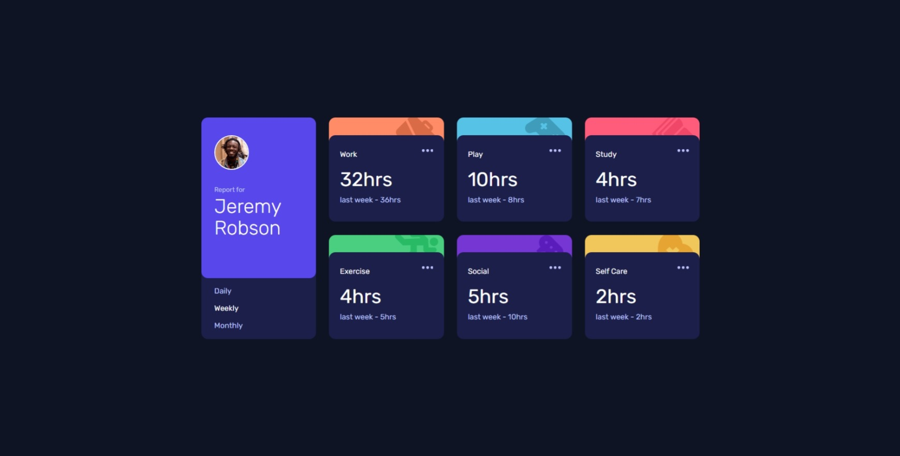

# Frontend Mentor - Advice generator app solution

This is a solution to the [Advice generator app challenge on Frontend Mentor](https://www.frontendmentor.io/challenges/advice-generator-app-QdUG-13db). Frontend Mentor challenges help you improve your coding skills by building realistic projects.

## Table of contents

- [Overview](#overview)
  - [The challenge](#the-challenge)
  - [Screenshot](#screenshot)
  - [Links](#links)
  - [Built with](#built-with)
  - [Useful resources](#useful-resources)
- [Author](#author)

## Overview

### The challenge

Users should be able to:

- View the optimal layout for the app depending on their device's screen size
- See hover states for all interactive elements on the page
- Generate a new piece of advice by clicking the dice icon

### Screenshot

### Links

- Solution URL: [github](https://github.com/them7d/advice-generator-app)
- Live Site URL: [live page](https://them7d.github.io/advice-generator-app)

### Built with

- placeholder-loading
- loading.io
- tailwind

### Useful resources

- [Example resource 1](https://github.com/zalog/placeholder-loading) placeholder loading text css library with my customize
- [Example resource 2](https://loading.io/) awesome resource for loading

## Author

- Website - [Mohammad Zaid](https://www.github.com/them7d)
- Frontend Mentor - [@them7d](https://www.frontendmentor.io/profile/them7d)
