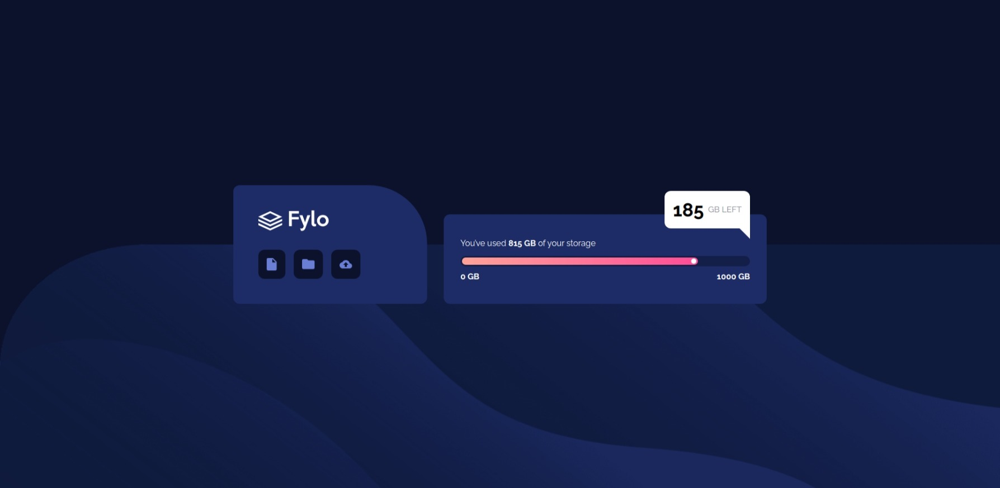

# Frontend Mentor - Fylo data storage component solution

This is a solution to the [Fylo data storage component challenge on Frontend Mentor](https://www.frontendmentor.io/challenges/fylo-data-storage-component-1dZPRbV5n). Frontend Mentor challenges help you improve your coding skills by building realistic projects.

## Table of contents

- [Overview](#overview)
  - [The challenge](#the-challenge)
  - [Screenshot](#screenshot)
  - [Links](#links)
- [My process](#my-process)
  - [Built with](#built-with)
- [Author](#author)

## Overview

### The challenge

Users should be able to:

- View the optimal layout for the site depending on their device's screen size

### Screenshot

### Links

- Solution URL: [repo](https://github.com/them7d/frontend-mentor/fylo-data-storage-component)
- Live Site URL: [live](https://them7d.github.io/frontend-mentor/fylo-data-storage-component)

## My process

### Built with

- Semantic HTML5 markup
- CSS custom properties
- Flexbox
- Tailwindcss

## Author

- Website - [Mohammad Zaid](https://www.github.com/them7d)
- Frontend Mentor - [@them7d](https://www.frontendmentor.io/profile/them7d)
