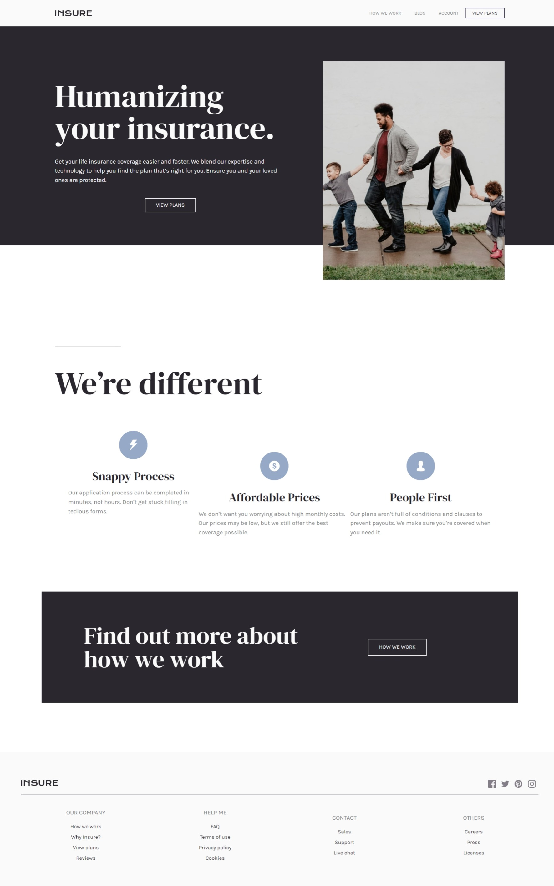

# Frontend Mentor - Insure landing page solution

This is a solution to the [Insure landing page challenge on Frontend Mentor](https://www.frontendmentor.io/challenges/insure-landing-page-uTU68JV8). Frontend Mentor challenges help you improve your coding skills by building realistic projects. 

## Table of contents

- [Overview](#overview)
  - [The challenge](#the-challenge)
  - [Screenshot](#screenshot)
  - [Links](#links)
- [My process](#my-process)
  - [Built with](#built-with)
  - [Useful resources](#useful-resources)
- [Author](#author)

**Note: Delete this note and update the table of contents based on what sections you keep.**

## Overview

### The challenge

Users should be able to:

- View the optimal layout for the site depending on their device's screen size
- See hover states for all interactive elements on the page

### Screenshot

### Links

- Solution URL: [github](https://github.com/them7d/frontend-mentor/insure-landing-page)
- Live Site URL: [Add live site URL here](https://them7d.github.io/frontend-mentor/insure-landing-page)

## My process

### Built with

- tailwindcss

### Useful resources

- [tailwind](https://www.tailwindcss.com) css library

## Author

- Website - [Mohammad Zaid](https://github.com/them7d)
- Frontend Mentor - [@yourusername](https://www.frontendmentor.io/profile/them7d)
